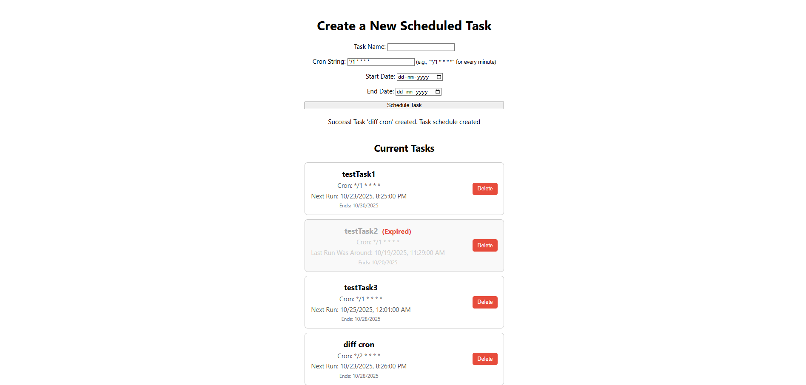
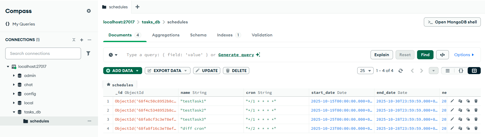
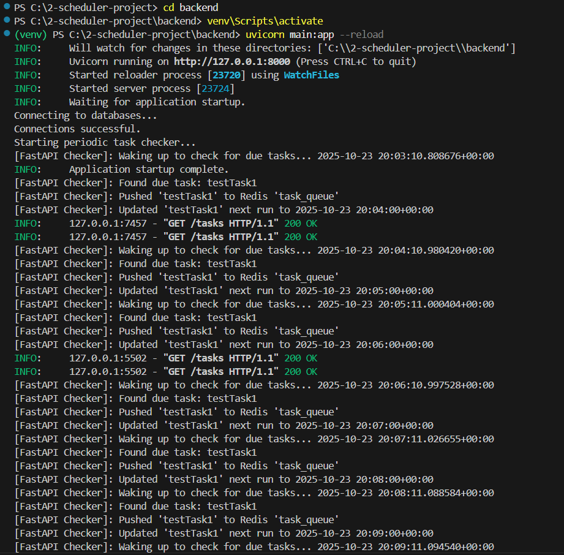
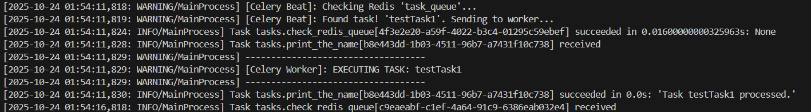
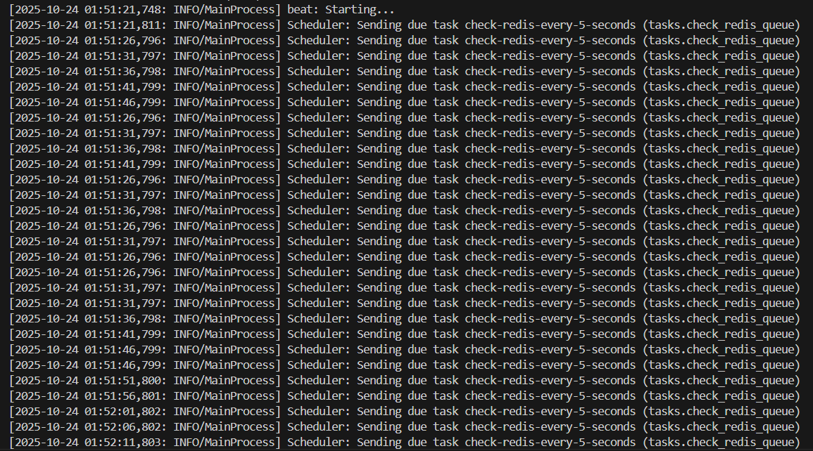

# 🏷️ FastAPI + Celery Task Scheduler

## 📝 Description

A full-stack web application demonstrating asynchronous task scheduling using a distributed architecture. Users can schedule tasks via a React frontend (styled with Chakra UI), which are saved persistently in MongoDB. A FastAPI backend periodically checks for due tasks based on their schedule and queues them in Redis. A separate Celery worker picks up tasks from the Redis queue and executes them (currently prints the task name).






## 🛠️ Technologies Used

Frontend: React, Chakra UI, Axios

Backend: FastAPI (Python), Uvicorn

Database: MongoDB

Message Broker / Queue: Redis

Task Queue / Background Worker: Celery (Python)

Containerization: Docker, Docker Compose

Libraries: motor (Async MongoDB driver), redis-py (Async Redis driver), celery[redis], croniter

## ⚙️ Setup and Installation

Prerequisites

Python 3.10+

Node.js (v16+ recommended) & npm

Docker Desktop

Git

## 🚀 How to Run

Follow these steps precisely in separate terminal windows.

### 1. Clone the Repository
```
git clone https://github.com/Aditya-Raj-1665/task-scheduler-app
```
cd into it.

### 2. Start Databases (Docker) - Terminal 1

This starts MongoDB and Redis containers in the background.
```
docker-compose up -d
```


(Note: Redis runs on host port 6340 in this setup, mapped to container port 6379).

### 3. Set up Backend (FastAPI) - Terminal 2

This runs the API server and the task polling mechanism.
```
# Navigate to the backend directory
cd backend

# Create and activate a virtual environment
python -m venv venv
# On Windows:
.\venv\Scripts\activate
# On macOS/Linux:
# source venv/bin/activate

# Install backend dependencies FROM the requirements file
python -m pip install -r requirements.txt 

# Run the FastAPI server
uvicorn main:app --reload
```



(Server will run on http://localhost:8000)

### 4. Set up Frontend (React) - Terminal 3

This runs the user interface.
```
# Navigate to the frontend directory
cd frontend

# Install frontend dependencies
npm install

# Run the React development server
npm start
```

(App will open at http://localhost:3000 or the next available port like 3001).

### 5. Set up Worker (Celery) - Terminal 4

This process waits for and executes tasks from the Redis queue.
```
# Navigate to the worker directory
cd worker

# Create and activate a virtual environment
python -m venv venv
# On Windows:
.\venv\Scripts\activate
# On macOS/Linux:
# source venv/bin/activate

# Install worker dependencies FROM the requirements file
python -m pip install -r requirements.txt

# Run the Celery worker (use --pool=solo on Windows)
celery -A tasks worker --loglevel=INFO --pool=solo
```




### 6. Set up Beat (Celery Scheduler) - Terminal 5

This process periodically triggers the task checker defined in tasks.py.
```
# Navigate to the worker directory
cd worker

# Activate the virtual environment (if not already active in this terminal)
# On Windows:
.\venv\Scripts\activate
# On macOS/Linux:
# source venv/bin/activate

# Run the Celery beat scheduler
celery -A tasks beat --loglevel=INFO
```



## 📁 Project Structure
```
/
├── backend/            # FastAPI application, API endpoints, periodic checker
│   ├── venv/
│   ├── main.py
│   └── requirements.txt
├── frontend/           # React application (UI)
│   ├── node_modules/
│   ├── public/
│   ├── src/
│   ├── package.json
│   └── ...
├── worker/             # Celery worker and beat configuration
│   ├── venv/
│   ├── tasks.py
│   └── requirements.txt
├── .gitignore          # Files ignored by Git
├── docker-compose.yml  # Defines Mongo & Redis services
└── README.md           # This file
```

## ✨ Features

Schedule tasks with name, cron string, start date, and end date via a web UI (React + Chakra UI).

View a list of currently scheduled tasks fetched from the database.

Delete scheduled tasks via the UI.

Expired tasks are visually indicated (grayed out/strikethrough).

FastAPI backend periodically checks MongoDB for tasks due to run (within start/end dates).

Due tasks are pushed to a Redis list acting as a queue.

Celery Beat periodically triggers a task checker defined in tasks.py (every 5 seconds).

Celery Worker picks up task names from the Redis queue and executes the corresponding task (prints task name to its console).
