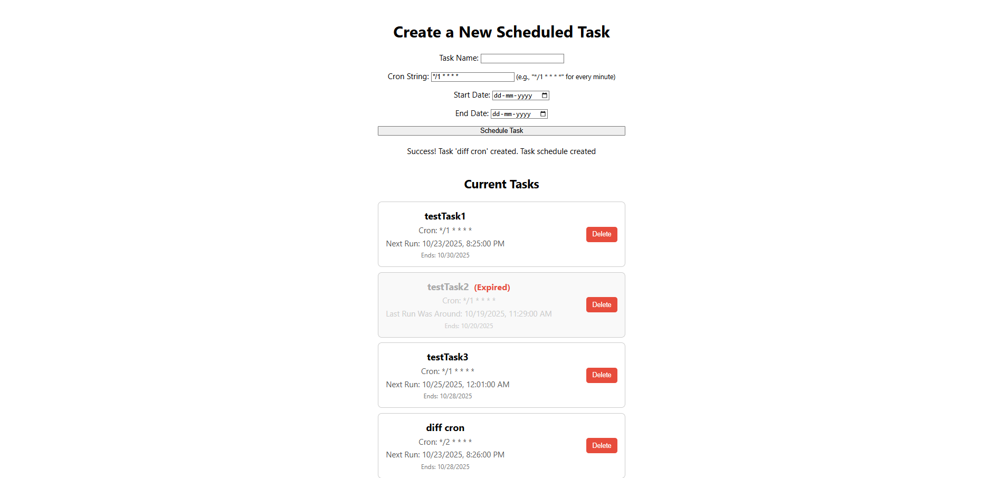

# Task Scheduler

A distributed task scheduling system that lets you create, schedule, and execute recurring jobs through a web dashboard. You define tasks with cron expressions and date ranges — the system handles the rest: queuing, priority sorting, parallel execution, timeouts, cancellation, and automatic retries.

## How It Works

1. You schedule a task through the React frontend (name, cron expression, date range)
2. FastAPI backend validates the input, computes the first run time, and saves it to MongoDB
3. A background loop checks every 60 seconds for tasks that are due to run
4. Due tasks are sorted by priority, inserted into a queue table, and pushed into a Redis list
5. Celery Beat checks the Redis list every 5 seconds and dispatches tasks to Celery Workers
6. Each worker spawns the task as an isolated subprocess with a watchdog thread monitoring for cancellation and timeouts
7. After execution, tasks are cleaned up from both the queue and schedule tables



## Tech Stack

| Technology | Role |
|---|---|
| **React** | Frontend dashboard for creating, viewing, and deleting tasks |
| **FastAPI** | REST API + background scheduler loop |
| **MongoDB** | Persistent storage for task schedules and execution queue |
| **Redis** | Message broker between scheduler and workers; also holds cancel signals |
| **Celery** | Distributed task queue — worker executes jobs, beat triggers periodic checks |
| **Docker Compose** | Runs MongoDB and Redis containers locally |
| **motor** | Async MongoDB driver for FastAPI |
| **croniter** | Parses and evaluates cron expressions |
| **Pydantic** | Data validation for all API inputs and database models |

## Project Structure

```
├── backend/
│   ├── main.py              # FastAPI app, routes, lifespan (startup/shutdown)
│   ├── manager.py           # TaskManager — scheduling loop, queue logic, CRUD
│   ├── models.py            # Pydantic models (TaskInput, TaskInDB, TaskInRedis, etc.)
│   ├── config.json          # Runtime config (max_parallelism, batch size)
│   ├── seed.py              # Script to populate MongoDB with test tasks
│   └── requirements.txt     # Python dependencies for backend
│
├── worker/
│   ├── tasks.py             # Celery app, task definitions, watchdog, process spawning
│   ├── base_operator.py     # BaseOperator abstract class + SIGTERM-safe runner
│   ├── operators/           # Operator scripts (each task runs one of these)
│   │   └── example_operator.py
│   └── requirements.txt     # Python dependencies for worker
│
├── frontend/
│   ├── src/
│   │   ├── App.js           # Main React component — form + task list
│   │   └── index.js         # React entry point
│   ├── public/
│   └── package.json
│
├── images/                  # Screenshots for documentation
├── docker-compose.yml       # MongoDB + Redis services
├── .env                     # Port configuration
├── .gitignore
├── WORKFLOW_VISUALIZATION.md  # Detailed architecture diagrams (Mermaid)
└── README.md
```

## How to Run Locally

### Prerequisites

- **Python 3.10+**
- **Node.js v16+** and npm
- **Docker Desktop** (for MongoDB and Redis)
- **Git**

### 1. Clone the repository

```bash
git clone https://github.com/Aditya-Raj-1665/task-scheduler-app
cd task-scheduler-app
```

### 2. Start databases — Terminal 1

```bash
docker-compose up -d
```

This starts MongoDB (port 27017) and Redis (host port 6340 → container port 6379).

### 3. Start the backend (FastAPI) — Terminal 2

```bash
cd backend
python -m venv venv

# Windows:
.\venv\Scripts\activate
# macOS/Linux:
# source venv/bin/activate

pip install -r requirements.txt
uvicorn main:app --reload
```

Server runs at **http://localhost:8000**

### 4. Start the frontend (React) — Terminal 3

```bash
cd frontend
npm install
npm start
```

App opens at **http://localhost:3000**

### 5. Start the Celery worker — Terminal 4

```bash
cd worker
python -m venv venv

# Windows:
.\venv\Scripts\activate
# macOS/Linux:
# source venv/bin/activate

pip install -r requirements.txt
celery -A tasks worker --loglevel=INFO --pool=solo
```

### 6. Start Celery Beat (scheduler) — Terminal 5

```bash
cd worker

# Activate the same venv
.\venv\Scripts\activate

celery -A tasks beat --loglevel=INFO
```

### Environment Variables

The `.env` file contains port configuration:

```
MONGO_HOST_PORT=27017
REDIS_HOST_PORT=6340
FASTAPI_PORT=8080
```

> **Note:** These values are currently not read by the application code — ports are hardcoded. See the "Known Issues" section below.

## API Endpoints

| Method | Endpoint | Description |
|--------|----------|-------------|
| `POST` | `/tasks` | Create a new scheduled task |
| `GET` | `/tasks` | List all task schedules |
| `GET` | `/tasks/queue` | List tasks currently in the execution queue |
| `DELETE` | `/tasks/{task_id}` | Delete a task schedule by its MongoDB ID |
| `POST` | `/tasks/{task_name}/cancel` | Cancel a running task (sets a Redis flag) |

### Example: Create a Task

```json
POST /tasks
{
  "task_name": "daily_sales_report",
  "cron": "0 2 * * *",
  "start_date": "2026-01-01T00:00:00+00:00",
  "end_date": "2026-12-31T23:59:59+00:00",
  "priority": 1,
  "task_config": {
    "operator_path": "operators/example_operator.py",
    "payload": { "task_name": "daily_sales_report" },
    "connection": {}
  }
}
```

## Checking the Redis Queue

To see how many tasks are pending in the Redis queue:

```bash
docker-compose exec redis redis-cli llen batch_run
```

## Known Issues / TODOs

- **Hardcoded connection strings** — MongoDB URI, Redis host/port, and CORS origins are hardcoded in the source code rather than read from environment variables or `.env`
- **Duplicate task names** — No uniqueness constraint on `task_name`; creating two tasks with the same name can cause undefined behavior in cancellation and cleanup
- **`fun_done()` loop not started** — The `TaskManager.fun_done()` background loop (cleans completed tasks from queue_table) is defined but not called in `main.py`'s lifespan
- **CRA boilerplate** — Frontend still contains unused Create React App files (`App.test.js`, `setupTests.js`, `reportWebVitals.js`, `logo.svg`, default `App.css`)
- **No authentication** — All API endpoints are publicly accessible
- **No HTTPS** — Runs entirely over HTTP
- **`aws console.txt`** — Contains an AWS Lambda handler stub; appears to be a development artifact
